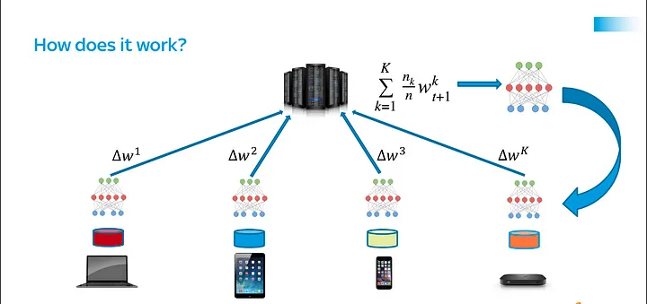

**Project Descriptions**

Federated Learning is a decentralized approach to training machine learning models using data from multiple sources while preserving privacy. In traditional machine learning, data is sent to a central server for training, but in Federated Learning, the training happens on the individual devices or clients themselves.

For example, let's consider the task of classifying handwritten digits using the popular MNIST dataset. Instead of collecting all the data and training the model on a central server, we can distribute the training process to multiple devices or clients, each having a subset of the data. In this case, we assume there are 7 clients.

The Federated Learning process involves multiple rounds of communication between the central server and the clients. In each round, the clients locally train the model using their own data. They compute the gradients based on their data and send only the model updates (gradients) to the central server. The server aggregates these updates from all clients to create a global model. The updated global model is then sent back to the clients, and the process repeats for a specified number of rounds, such as 100 rounds in our case.

By training the model locally on the clients and exchanging only the model updates, Federated Learning ensures that the raw data remains on the client devices, preserving privacy. It also reduces the need for transmitting large amounts of data over the network, making it more efficient and scalable.

With this approach, each client contributes to the model training process while maintaining the confidentiality of their data. As a result, the final global model represents the collective knowledge from all clients while respecting data privacy.

